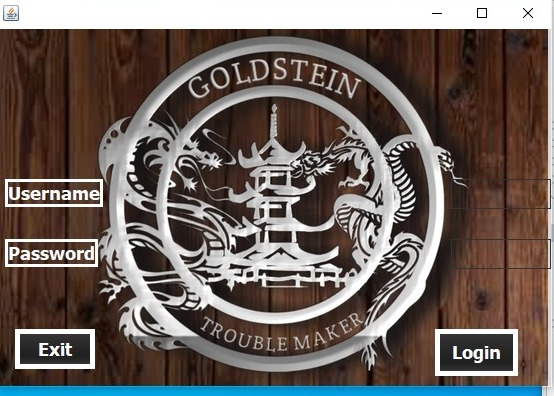
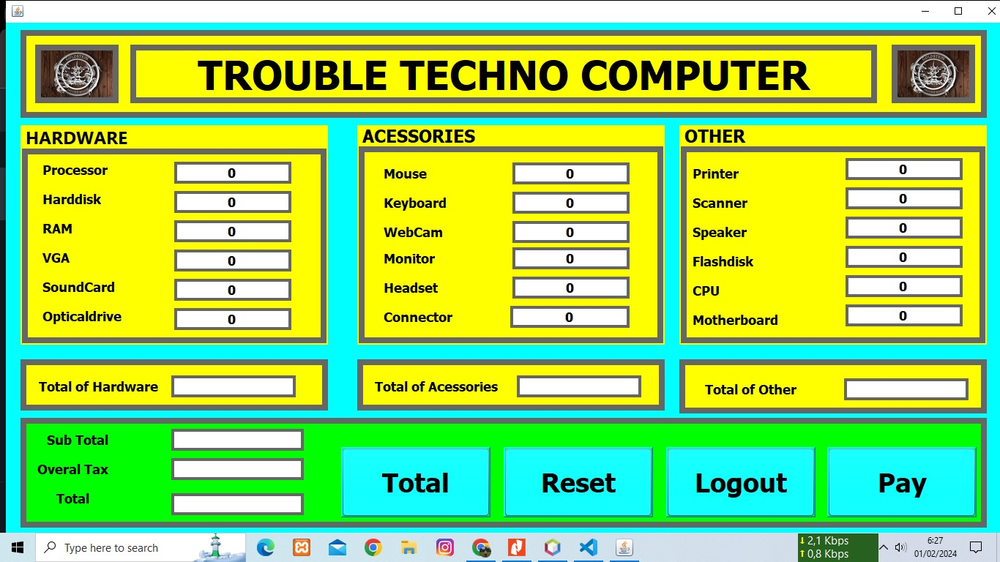
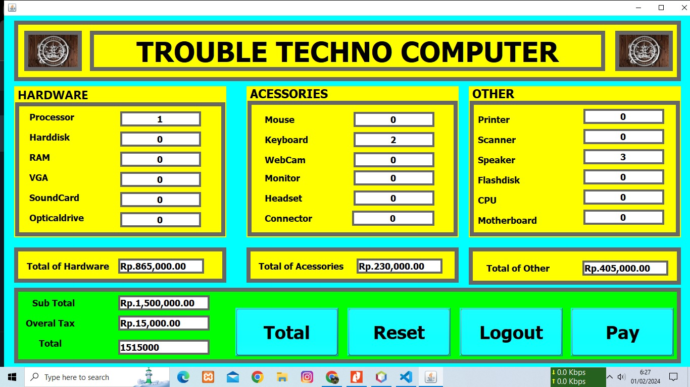
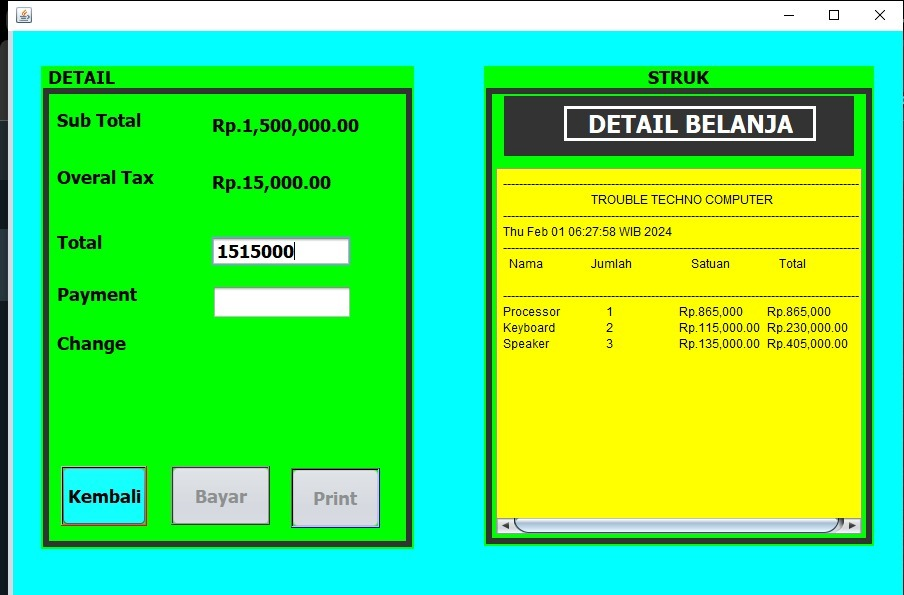
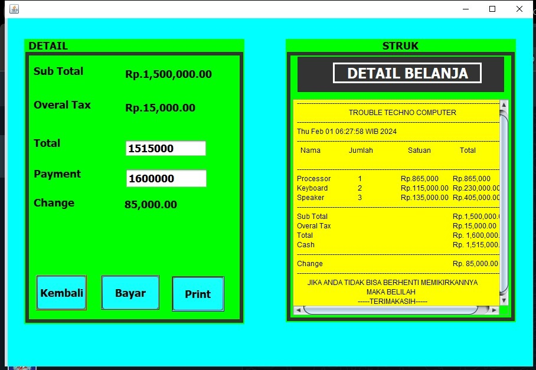

# Aplikasi Kasir Sederhana

   

Sales Management Sistem adalah aplikasi penjualan sederhana. Terdapat 3 menu utama yang terdapat pada aplikasi ini yakni  Login Page, Home Page, Detail Page, 
 

## 💻 Pengguna Sistem
Pengguna yang dapat memakai sistem ini adalah hanya Admin.

## 👨‍💻 Skenario Kebutuhan Pengguna
### Admin
<ol>
  <li>Admin dapat melakukan login.</li>
  <li>Admin dapat melihat, menambahkan, memperbarui dan menghapus data Barang .</li>
  <li>Admin dapat melakukan proses penhitungan barang yang akan di beli oleh costumer</li>
  <li>Admin dapat melakukan logout.</li>
</ol>

## 🖼️ Screenshot Aplikasi
<table width="100%">
  <tbody>
    <tr>
    <td width="33%">
        <h5 style="text-align: center">Login Form</h5>
        
      </td>
      <td width="33%">
        <h5 style="text-align: center">Home Form</h5>
         
      </td>
      <td width="33%">
        <h5 style="text-align: center">Penjumlahan Barang</h5>
        
      </td>  
    </tr>
    <tr>
      <td width="33%">
        <h5 style="text-align: center">Detail Penjualan</h5>
        
      </td> 
      <td width="33%">
        <h5 style="text-align: center">Total Harga Barang, cetak Struk</h5>
        
      </td> 
    </tr>
  </tbody>
</table>

## 📝 Prerequisite
Untuk menjalankan aplikasi ini disarankan untuk menyiapkan aplikasi berikut ini :
  - [x] Apache NetBeans IDE 17
  - [x] Java JDK <code>20.0.0</code>
  - [x] Git <code>2.35.1</code>

## 📜 Credit & License
Project ini mengacu pada modul praktik dari mata kuliah Pemrograman Berbasis Objek. Project ini bersifat open-source untuk edukasi.
<blockquote>Kuliah...? BSI AJA !!</blockquote>
